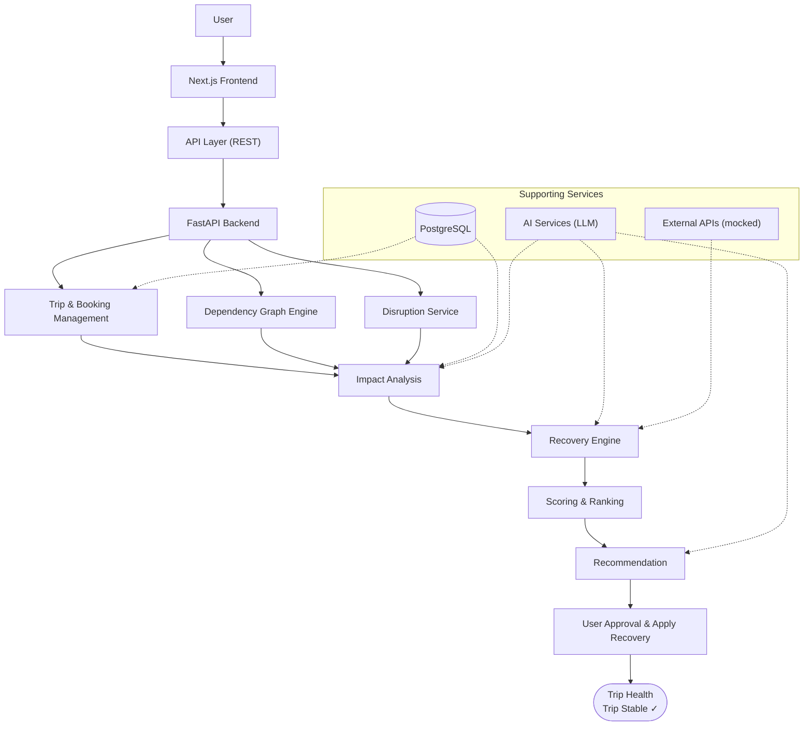
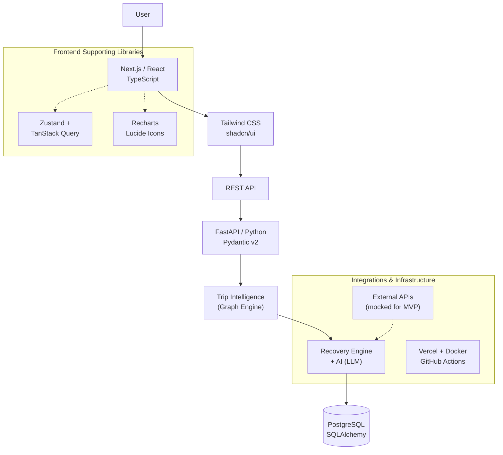
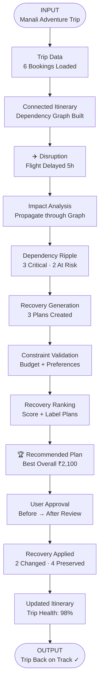
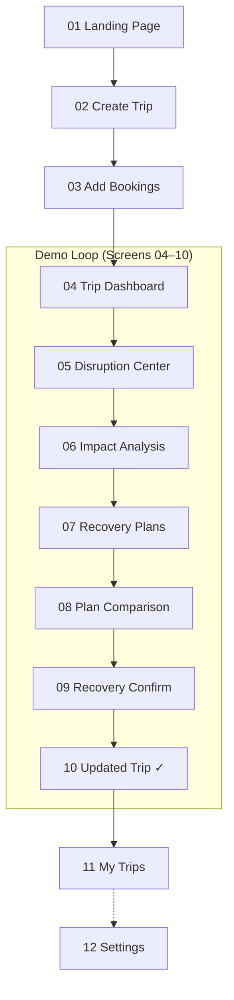
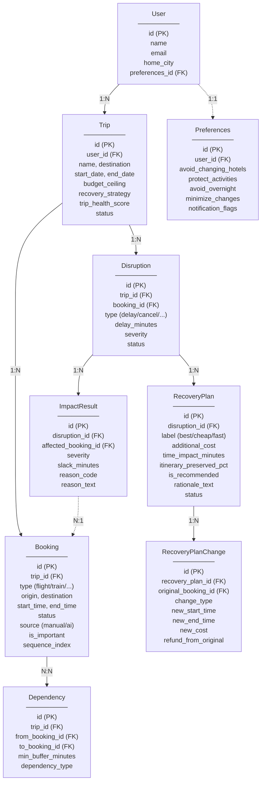
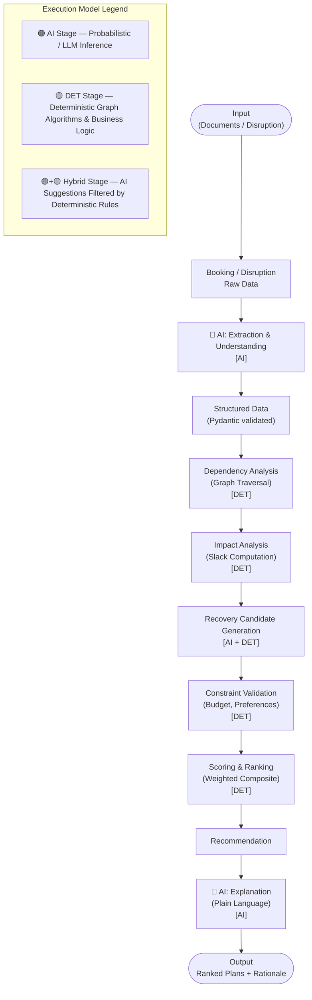

# TripRescue — Complete System Flowcharts

This document provides a clean, sequence-wise visual representation of all existing TripRescue architecture and workflow diagrams. The source of truth for these flowcharts is the system's Draw.io diagrams located in the `/diagrams` workspace directory.

---

## 1. System Architecture Flow

The System Architecture represents the end-to-end operational pipeline of TripRescue. User interactions flow from the Next.js frontend across a REST API into the FastAPI backend, where trip data, dependency graphs, and disruptions converge into the Impact Analysis engine. Supported asynchronously by PostgreSQL, LLM services, and external travel APIs, the recovery engine generates, ranks, and recommends actionable rescue plans for user approval.

### Sequence
- **Step 1 — User Request Ingestion**: The user initiates actions via the Next.js Frontend, which dispatches requests through the REST API layer to the FastAPI backend.
- **Step 2 — Core Domain Processing**: The backend delegates workloads across three specialized micro-modules: Trip & Booking Management (persisted via PostgreSQL), Dependency Graph Engine (DAG construction), and Disruption Service.
- **Step 3 — Impact Analysis**: Data from all three services converges into Impact Analysis, augmented by PostgreSQL state queries and LLM-assisted context parsing to evaluate delay propagation and slack times.
- **Step 4 — Recovery Engine & Candidate Generation**: The Recovery Engine consults external travel APIs (mocked) and LLM candidate generation to generate feasible re-booking options that resolve itinerary conflicts.
- **Step 5 — Scoring, Ranking & Recommendation**: Deterministic scoring algorithms rank recovery options across cost, duration, and convenience, producing a prioritized recommendation with AI-generated plain-language rationale.
- **Step 6 — User Approval & State Stabilization**: The user reviews and approves the optimal recovery plan; the system commits modifications to the itinerary and recalculates Trip Health to achieve a stable state (`Trip Stable ✓`).

---

## 2. Tech Stack Flow

The Tech Stack Flow depicts the layered technology architecture powering TripRescue. The stack enforces strict separation of concerns, transitioning from a reactive TypeScript/Next.js frontend styled with Tailwind CSS and shadcn/ui down through a strongly-typed FastAPI/Pydantic backend to the Trip Intelligence engine, AI recovery services, and PostgreSQL persistence.

### Sequence
- **Step 1 — Client Layer**: The user interacts with Next.js / React / TypeScript web application, with client state managed by Zustand and TanStack Query, and data visualisations rendered via Recharts and Lucide Icons.
- **Step 2 — Design System & Interface Components**: User actions route through UI components built using Tailwind CSS and shadcn/ui primitives.
- **Step 3 — API Boundary**: Frontend requests are serialized into JSON payloads transmitted over REST API endpoints.
- **Step 4 — Backend Service Layer**: FastAPI parses and strictly validates incoming payloads using Pydantic v2 schemas in Python.
- **Step 5 — Graph Intelligence Execution**: The validated data feeds into the Trip Intelligence Graph Engine for topological sorting and slack time calculation.
- **Step 6 — Recovery & LLM Synthesis**: Candidate solutions are evaluated by the Recovery Engine combined with LLM prompting, pulling mock data from External APIs.
- **Step 7 — Persistence & Delivery**: Results are persisted in PostgreSQL via SQLAlchemy ORM, and the application lifecycle is managed via Docker containers, Vercel deployments, and GitHub Actions CI/CD.

---

## 3. Demo Input → Output Flow

The Demo Input → Output Flow traces the step-by-step hackathon journey from importing a complex travel itinerary to resolving a major flight delay. It demonstrates how a 5-hour flight delay ripples across downstream bookings, triggers automated impact analysis, evaluates candidate recovery plans, and restores the trip to 98% Trip Health.

### Sequence
- **Step 1 — Input Initiation**: The demo starts with the "Manali Adventure Trip" itinerary.
- **Step 2 — Data Ingestion**: The system loads 6 diverse bookings (flights, cab transfers, hotel check-ins, adventure activities).
- **Step 3 — Graph Construction**: Bookings are assembled into a connected itinerary DAG with calculated time buffers and dependencies.
- **Step 4 — Disruption Injection**: A simulated disruption event occurs: the outbound flight experiences a 5-hour delay.
- **Step 5 — Impact Propagation**: The Impact Analysis engine traverses the dependency graph to evaluate negative slack across consecutive events.
- **Step 6 — Ripple Detection**: The system identifies 3 critically broken bookings and 2 at-risk downstream connections.
- **Step 7 — Candidate Generation**: The Recovery Engine synthesizes 3 distinct recovery plan strategies.
- **Step 8 — Constraint Validation**: Candidate plans are checked against user budget ceilings and personal travel preferences.
- **Step 9 — Ranking & Scoring**: Multi-factor scoring evaluates and labels the alternatives (e.g., Best Overall, Lowest Cost, Fastest).
- **Step 10 — Recommendation Selection**: The top plan is presented ("🏆 Recommended Plan: Best Overall ₹2,100").
- **Step 11 — User Review**: The traveler inspects the interactive side-by-side Before → After comparison.
- **Step 12 — Plan Application**: Upon user confirmation, changes are applied: 2 bookings updated and 4 non-conflicting bookings preserved.
- **Step 13 — Itinerary Update**: The itinerary graph refreshes, updating the Trip Health score to 98%.
- **Step 14 — Output Resolution**: The trip is successfully stabilized ("Trip Back on Track ✓").

---

## 4. User Flow

The User Flow maps the comprehensive journey of a traveler through all 12 interface screens of the TripRescue web application. It highlights the core interactive "Demo Loop" (Screens 04 through 10), which represents the primary problem-detection, impact-assessment, and automated-recovery experience.

### Sequence
- **Step 1 — Entry & Onboarding (Screen 01)**: The user accesses the Landing Page, discovering platform capabilities and call-to-actions.
- **Step 2 — Trip Creation (Screen 02)**: The user defines trip metadata (destination, start/end dates, recovery strategy, budget ceiling).
- **Step 3 — Booking Addition (Screen 03)**: Travel segments (flights, trains, hotels, activities) are added via form inputs or mock ticket upload.
- **Step 4 — Dashboard Monitoring (Screen 04)**: The user lands on the Trip Dashboard, viewing the chronological timeline, Trip Health score, and connected itinerary.
- **Step 5 — Disruption Simulation (Screen 05)**: In the Disruption Center, delay or cancellation events are triggered or received.
- **Step 6 — Impact Inspection (Screen 06)**: The user navigates to Impact Analysis to see the affected nodes, broken buffers, and cascade severities.
- **Step 7 — Plan Exploration (Screen 07)**: The system displays generated recovery options with cost, time delta, and preservation badges.
- **Step 8 — Comparison (Screen 08)**: The user evaluates plans side-by-side in Plan Comparison, reviewing trade-offs.
- **Step 9 — Confirmation (Screen 09)**: In Recovery Confirm, the user reviews a detailed diff of modifications before final execution.
- **Step 10 — Resolution (Screen 10)**: The Updated Trip screen displays the re-stabilized itinerary and restored Trip Health.
- **Step 11 — Portfolio & Configuration (Screens 11 & 12)**: The user can navigate back to My Trips for an overview of all active/past trips or manage preferences in Settings.

---

## 5. Data Architecture Flow

The Data Architecture represents the entity-relationship schema powering TripRescue. It maps how users, trips, bookings, and dependency constraints interact with disruptions, impact records, recovery plans, and granular plan changes, ensuring full referential integrity and auditability.

### Sequence
- **Step 1 — User & Preferences Setup**: A `User` record is created, linking via a 1:1 relationship to user-level travel constraints and policies in `Preferences`.
- **Step 2 — Trip Creation**: A `User` owns one or more `Trip` records (1:N) containing destination dates, budget ceiling, recovery strategy, and composite `trip_health_score`.
- **Step 3 — Booking Items**: Each `Trip` aggregates multiple `Booking` items (1:N) storing modality, origin, destination, timings, and importance flags.
- **Step 4 — Graph Dependencies**: Adjoining bookings are linked through `Dependency` records (N:N relationship between `from_booking_id` and `to_booking_id`), capturing required minimum transfer buffers and constraint types.
- **Step 5 — Disruption Logging**: When an unexpected change occurs, a `Disruption` record links to the specific parent `Trip` and initial trigger `Booking` (1:N).
- **Step 6 — Impact Quantification**: The engine records one or more `ImpactResult` rows per disruption (1:N), cross-referencing each affected downstream booking (N:1) with slack times and severity codes.
- **Step 7 — Plan & Delta Generation**: For each disruption, multiple `RecoveryPlan` records are generated (1:N). Each plan contains one or more atomic `RecoveryPlanChange` entries (1:N) tracking modifications, costs, and refunds.

---

## 6. AI Pipeline Flow

The AI Pipeline Flow defines the strict demarcation between non-deterministic AI capabilities and deterministic backend computation. Generative AI is deployed exclusively for unstructured text extraction and plain-language reasoning explanations, while graph traversals, slack time calculations, feasibility checking, and composite scoring remain 100% deterministic and mathematically reproducible.

### Sequence
- **Step 1 — Input Ingestion**: Unstructured travel documents, raw ticket text, or carrier disruption announcements enter the pipeline.
- **Step 2 — Raw Data Normalization**: Input text and files are packaged as raw input data payloads.
- **Step 3 — AI Extraction & Understanding `[AI]`**: An LLM processes raw unstructured text to identify entities (PNR, origin, destination, timestamps, transport types).
- **Step 4 — Schema Validation**: Extracted parameters are validated and coerced into typed Python schemas using Pydantic v2.
- **Step 5 — Dependency Analysis `[DET]`**: A deterministic graph algorithm builds the Directed Acyclic Graph (DAG) and executes topological sort to sequence itinerary connections.
- **Step 6 — Impact Analysis `[DET]`**: The deterministic engine computes slack minutes across connection buffers (`slack = arrival_time + buffer - next_departure_time`) to isolate broken nodes.
- **Step 7 — Recovery Candidate Generation `[AI + DET]`**: A hybrid phase queries available travel alternatives; AI proposes creative candidate shifts while deterministic rules ensure structural feasibility.
- **Step 8 — Constraint Validation `[DET]`**: Proposed plans undergo hard deterministic validation against budget limits, minimum connection buffers, and user travel preferences.
- **Step 9 — Scoring & Ranking `[DET]`**: A weighted mathematical composite scoring function calculates overall plan scores based on cost, time saved, and itinerary preservation percentage.
- **Step 10 — Top Recommendation Selection**: The highest-scoring candidate is chosen as the primary recommended recovery plan.
- **Step 11 — AI Explanation Synthesis `[AI]`**: An LLM translates the mathematical score trade-offs, changes, and cost deltas into clear, empathetic, human-readable rationale.
- **Step 12 — Output Generation**: The ranked recovery plans paired with clear contextual justifications are returned to the user interface.
